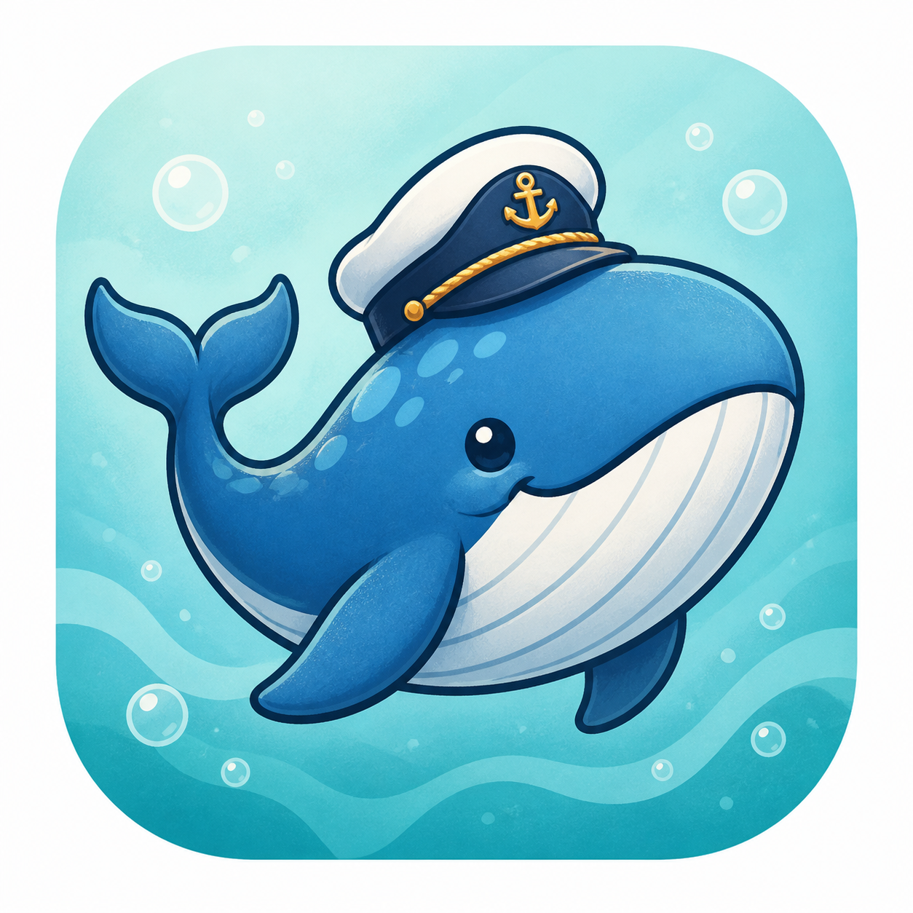
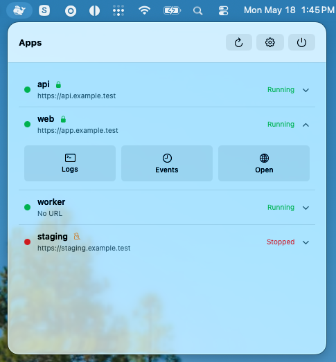

<p align="center">
  
</p>

<h1 align="center">Nemo</h1>

<p align="center">
  <strong>A macOS menu bar for keeping an eye on your Dokku apps.</strong>
</p>

<p align="center">
  Nemo pairs a small read-only agent on your Dokku host with a native macOS menu
  bar app, so app status, URLs, HTTPS state, logs, and platform events are only
  a click away.
</p>

## Screenshots

<p align="center">
  
</p>

## Install

### macOS App

The Homebrew cask lives in this repository, so tap the source repo directly:

```sh
brew tap omarestrella/nemo https://github.com/omarestrella/nemo
brew install --cask omarestrella/nemo/nemo
```

The cask downloads `Nemo.zip` from the latest GitHub release.

### Dokku Host Agent

On the Dokku host, install the latest released Linux agent and systemd
integration:

```sh
curl -fsSL https://omarestrella.github.io/nemo/install.sh | sh
```

The installer detects `x86_64` and `arm64` Linux hosts, installs
`/usr/local/bin/nemo-agent`, creates the dedicated `nemo-agent` service account,
installs the constrained Dokku wrapper, enables the systemd service, and runs
`doctor`.

Useful installer environment variables:

```sh
curl -fsSL https://omarestrella.github.io/nemo/install.sh | \
  NEMO_VERSION=v0.1.0 NEMO_HOST=127.0.0.1 NEMO_INSTALL_ONLY=1 sh
```

- `NEMO_VERSION`: release tag to install. Defaults to the latest release.
- `NEMO_HOST`: listener host for `nemo-agent init`. Defaults to `0.0.0.0`.
- `NEMO_PORT`: listener port. Defaults to `7331`.
- `NEMO_STATE_DIR`: state directory. Defaults to `/var/lib/nemo-agent`.
- `NEMO_INSTALL_ONLY=1`: install the binary without initializing host artifacts.

### Pair in the Browser

Open Nemo from the macOS menu bar. If your Dokku host is discovered on the
local network, choose it and click **Pair this Mac**.

Nemo opens the agent's browser approval page. Approve the request in the
browser, then return to the app. The macOS app completes pairing and stores the
credential in Keychain.

## Development

Install dependencies:

```sh
bun install
```

Run the agent locally with state in `.nemo-agent/`:

```sh
bun run dev
```

Useful commands:

```sh
bun src/index.ts init --state-dir .nemo-agent
bun src/index.ts doctor --fix --state-dir .nemo-agent
bun src/index.ts pair start --state-dir .nemo-agent --name "Dev Mac" --endpoint http://127.0.0.1:7331
bun src/index.ts serve --state-dir .nemo-agent
```

Run tests and compile Linux binaries:

```sh
bun test
bun run test:docker
bun run build:linux-x64
bun run build:linux-arm64
```

The Docker integration test starts a disposable `dokku/dokku` container, copies
the compiled agent into it, and exercises pairing plus the live HTTP API against
real Dokku commands. Use `bun run test:docker` to run only that test. It
requires Docker and may take several minutes the first time it pulls the Dokku
image.

## License

MIT
